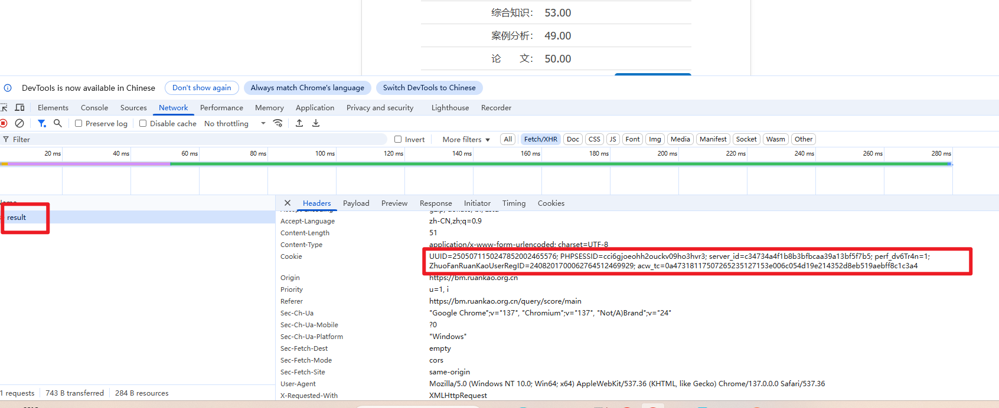
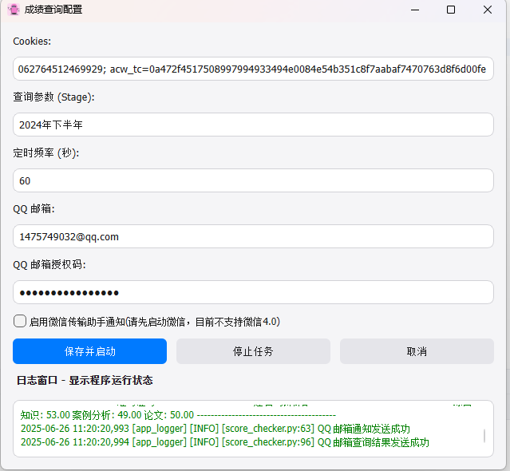
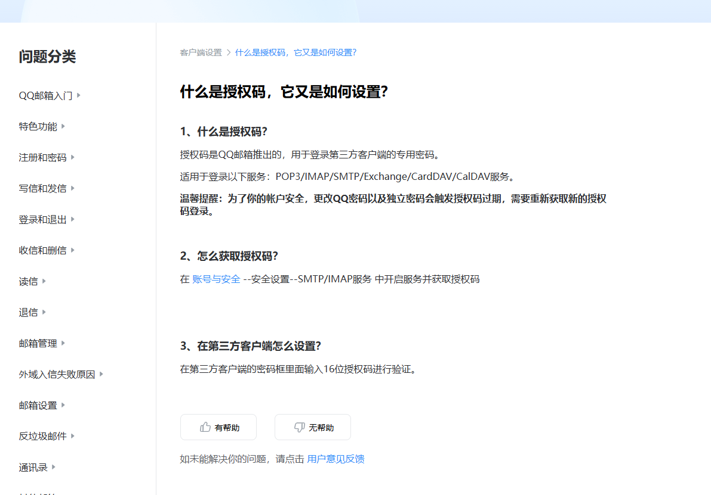

# ruan-kao-result-query 项目文档
软考成绩查询

## 环境要求

- **操作系统**: Windows 10/11
- **WeChat**: 3.9 不支持 4.0
- **依赖工具**: pip, PyInstaller

## 技术栈


## 安装与配置

- 在官网登录后，F12 找一个登录的查询结果，如图将其cookie 拷贝出来粘贴到输入框即可，

- 如果不想发送微信的文件传输助手则无须勾选启用。

- qq邮箱获取授权码网址：https://service.mail.qq.com/detail/0/75 实在不会的可以百度
### 1. 创建虚拟环境

为了避免依赖冲突，建议在项目中使用虚拟环境。以下是创建虚拟环境的步骤：

```shell
# 创建虚拟环境
python -m venv .venv

# 激活虚拟环境
# Windows
.venv\Scripts\activate

### 安装依赖

```shell
pip install -r requirements.txt
```

查看安装成功的依赖

```shell
pip list
```

### 运行调试

```shell
python main.py
```

### 终端打包
```shell
pyinstaller -F -w -i bot.ico --add-data "bot.ico;."   -n ruan-kao-result-query-V1.0 main.py
```
# 备注
如果觉得不错，请再右上角点一个 ⭐ Star